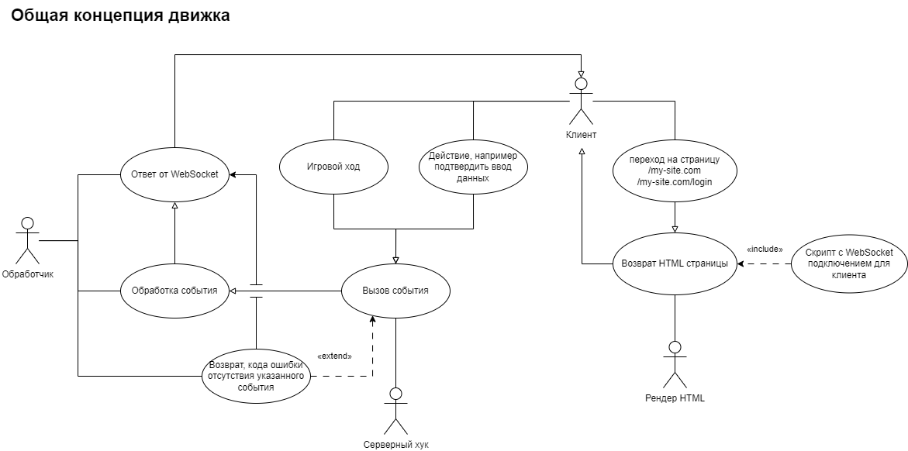
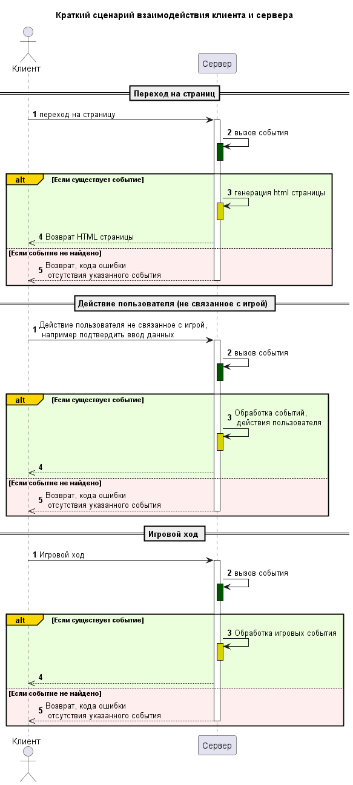
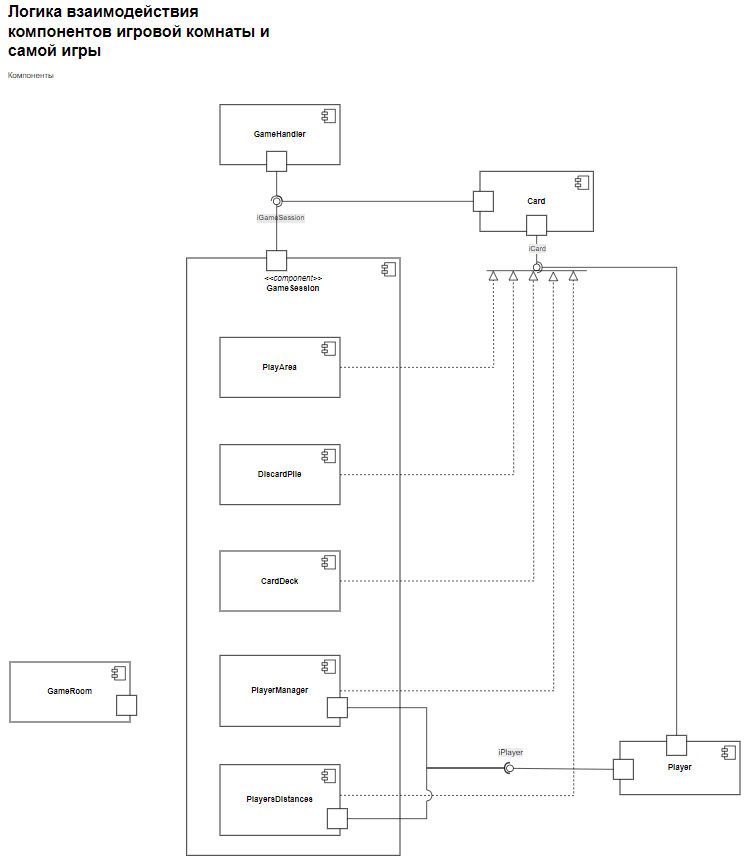
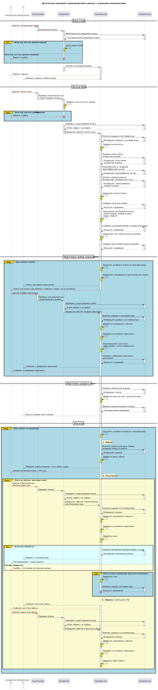
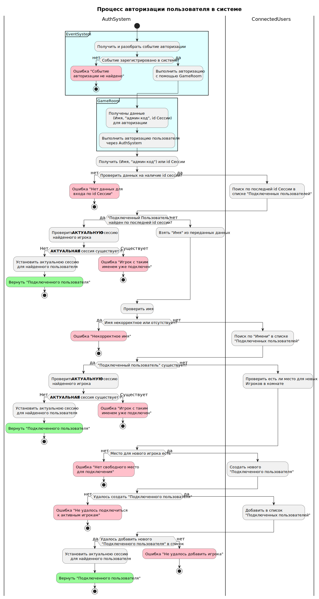
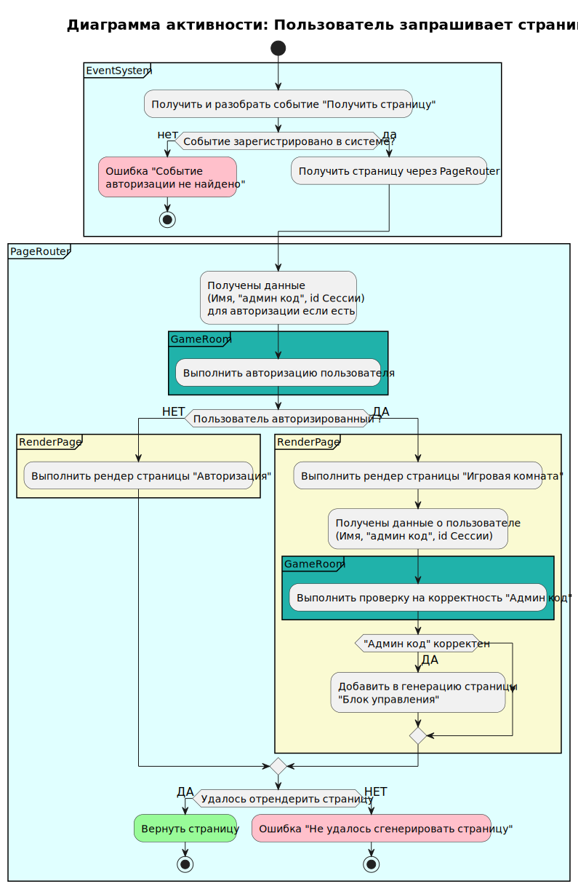
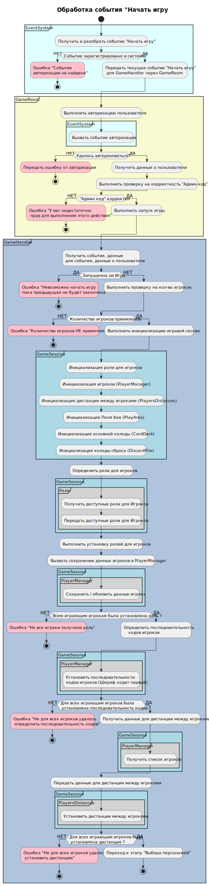
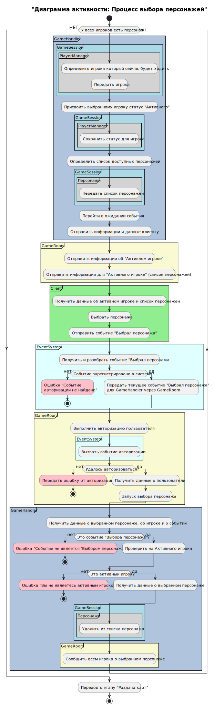

# Игра Bang

## Оглавление

1. [Обзор](#обзор)  
2. [Диаграммы (Общие)](#2-диаграммы-общие)  
   2.1. [Общая диаграмма архитектуры](#21-общая-диаграмма-архитектуры)  
   2.2. [Диаграмма последовательности: Взаимодействие клиента с игровыми компонентами](#22-диаграмма-последовательности-взаимодействие-клиента-с-игровыми-компонентами)  
   2.3. [Диаграмма компонентов бизнес-логики](#23-диаграмма-компонентов-бизнес-логики)  
   2.4. [Диаграмма взаимодействия клиента с основными компонентами бизнес-логики и серверными компонентами](#24-диаграмма-взаимодействия-клиента-с-основными-компонентами-бизнес-логики-и-серверными-компонентами)  
3. [Диаграммы отдельных событий / процессов](#3-диаграммы-отдельных-событий--процессов)  
   3.1. [Диаграмма активности: Процесс авторизации игрока в системе](#31-диаграмма-активности-процесс-авторизации-игрока-в-системе)  
   3.2. [Диаграмма активности: Запрос страницы пользователем](#32-диаграмма-активности-запрос-страницы-пользователем)  
   3.3. [Диаграмма активности: Обработка события "Начать игру"](#33-диаграмма-активности-обработка-события-начать-игру)  
   3.4. [Диаграмма активности: Процесс выбора персонажей](#34-диаграмма-активности-процесс-выбора-персонажей)
4. [Как запустить](#как-запустить)  
5. [Лицензия](#лицензия)

---

## Обзор

Основная цель движка — управление игровым процессом, валидация событий, обработка действий игроков и организация взаимодействия между клиентами и сервером. Система построена таким образом, чтобы каждый компонент отвечал за свою часть логики, а события запускали соответствующие процессы.

Вся игровая логика построена вокруг событий, таких как "карточный ход", "окончание хода" и другие, которые обрабатываются через систему событий и передаются между различными компонентами.

---

## 2. Диаграммы (Общие)

### 2.1 Общая диаграмма архитектуры

Эта диаграмма даёт общий обзор архитектуры игры, включая основные компоненты, их взаимодействия и связи. В ней показаны компоненты, управляющие сессиями игры, состоянием игроков и картами, а также система событий, координирующая действия.

### 2.2 Диаграмма последовательности: Взаимодействие клиента с игровыми компонентами

Диаграмма показывает процесс взаимодействия клиента с сервером.

### 2.3 Диаграмма компонентов бизнес-логики

Показывает структуру компонентов бизнес-логики, которые обрабатывают игровые события, управляют состоянием игры и игроков, а также взаимодействуют через систему событий.

### 2.4 Диаграмма взаимодействия клиента с основными компонентами бизнес-логики и серверными компонентами

Иллюстрирует, как клиент взаимодействует с сервером и основными игровыми компонентами, включая обработку событий и обмен данными.

---

## 3. Диаграммы отдельных событий / процессов

### 3.1 Диаграмма активности: Процесс авторизации игрока в системе

Диаграмма отражает процесс авторизации игрока, основанный на событии авторизации, обрабатываемом `AuthSystem`. Система получает и разбирает событие, проверяет его наличие, после чего выполняет авторизацию с использованием данных из `GameRoom` и `ConnectedUsers`.

#### Основные этапы процесса

- Получение и разбор события авторизации в `AuthSystem`  
- Проверка регистрации события в системе  
- Получение данных для авторизации (имя, "админ код", ID сессии)  
- Если передан `sessionId`:  
  - Поиск игрока по `sessionId` в списке подключённых пользователей  
  - Проверка актуальности сессии  
  - Если сессия неактуальна — установка актуальной сессии и успешное завершение  
  - Если сессия уже существует — ошибка "Игрок с таким именем уже подключен"  
- Если `sessionId` нет или игрок не найден:  
  - Проверка корректности имени  
  - Поиск игрока по имени  
  - Проверка актуальной сессии для найденного игрока  
  - Если сессия неактуальна — установка сессии и завершение авторизации  
  - Если сессия уже существует — ошибка "Игрок с таким именем уже подключен"  
- Если игрок по имени не найден:  
  - Проверка наличия свободных мест для новых игроков  
  - Создание нового подключённого пользователя  
  - Добавление нового игрока в список подключённых  
  - Установка актуальной сессии и подтверждение авторизации  

#### Компоненты

- `EventSystem` — инициатор обработки события  
- `AuthSystem` — обрабатывает событие авторизации и управляет проверкой и установкой сессий  
- `GameRoom` — предоставляет данные для авторизации и взаимодействует с `AuthSystem`  
- `ConnectedUsers` — хранит список текущих подключённых игроков и управляет их состояниями  

#### Возможные ошибки в процессе

- Событие авторизации не зарегистрировано в системе  
- Нет данных для входа по идентификатору сессии  
- Некорректное или отсутствующее имя  
- Игрок с таким именем уже подключён (активная сессия существует)  
- Нет свободного места для подключения новых игроков  
- Не удалось создать нового подключённого пользователя  
- Не удалось добавить нового игрока в список подключённых  

---

### 3.2 Диаграмма активности: Запрос страницы пользователем

Диаграмма описывает процесс обработки запроса страницы от пользователя в событийной архитектуре. Показывает, как система обрабатывает событие, выполняет авторизацию (если требуется), маршрутизирует и рендерит нужную страницу с учётом роли пользователя и корректности данных.

#### Основные этапы процесса "Запрос страницы пользователем"

- Получение события `Получить страницу` через `EventSystem`  
- Проверка регистрации события в системе  
- Передача запроса в `PageRouter` для выбора страницы  
- Извлечение данных авторизации (имя, admin-код, ID сессии)  
- Авторизация пользователя через `GameRoom`  
- В зависимости от результата:  
  - Если не авторизован — рендерится страница авторизации  
  - Если авторизован:  
    - Рендерится страница игровой комнаты  
    - Проверяется корректность admin-кода  
    - При корректном коде добавляется блок управления  

#### Компоненты "Запрос страницы пользователем"

- `EventSystem` — инициатор обработки события  
- `PageRouter` — определяет, какую страницу рендерить  
- `GameRoom` — отвечает за авторизацию и проверку admin-кода  
- `RenderPage` — формирует HTML-страницу на основе данных  

#### Возможные ошибки в процессе "Запрос страницы пользователем"

- Событие "Получить страницу" не зарегистрировано в системе  
- Не удалось отрендерить страницу  

---

### 3.3 Диаграмма активности: Обработка события "Начать игру"

Диаграмма отображает процесс обработки события "Начать игру", инициируемого системой событий. Основная логика реализуется в `GameRoom` и `GameHandler`, с участием компонентов `GameSession`, `PlayerManager`, `PlayersDistances`, `PlayArea`, `CardDeck` и `DiscardPile`.

#### Основные этапы процесса "Обработка события Начать игру"

- Получение и разбор события "Начать игру" в `EventSystem`  
- Проверка регистрации события в системе  
- Передача события в `GameRoom`  
- Авторизация пользователя и проверка "Админ кода"  
- При успешной авторизации и наличии прав:
  - Передача события в `GameHandler`
  - Проверка: не запущена ли уже игра
  - Проверка количества игроков
  - Инициализация игровой сессии:
    - Роли игроков
    - Игроки через `PlayerManager`
    - Дистанции через `PlayersDistances`
    - Поле боя (`PlayArea`)
    - Основная колода (`CardDeck`)
    - Колода сброса (`DiscardPile`)
  - Определение и установка ролей для игроков
  - Сохранение данных игроков через `PlayerManager`
  - Определение последовательности ходов (Шериф — первый)
  - Установка дистанций между игроками
  - Переход к этапу "Выбора персонажей"

#### Компоненты "Обработка события Начать игру"

- `EventSystem` — инициирует обработку события  
- `GameRoom` — выполняет авторизацию пользователя и проверку прав  
- `GameHandler` — управляет запуском игры и инициализацией  
- `GameSession` — хранит состояние игры, включая:
  - `PlayerManager` — управление игроками и ролями  
  - `PlayersDistances` — расчёт дистанций между игроками  
  - `PlayArea` — игровое поле  
  - `CardDeck` — основная колода  
  - `DiscardPile` — колода сброса  

#### Возможные ошибки в процессе "Обработка события Начать игру"

- Событие "Начать игру" не зарегистрировано в системе  
- Ошибка авторизации пользователя  
- Ошибка "У вас недостаточно прав для выполнения этого действия" (некорректный "Админ код")  
- Ошибка "Невозможно начать игру, пока предыдущая не будет закончена"  
- Ошибка "Количество игроков НЕ приемлемо"  
- Ошибка "Не все игроки получили роль"  
- Ошибка "Не для всех игроков удалось определить последовательность ходов"  
- Ошибка "Не для всех игроков удалось установить дистанцию"  

---

### 3.4 Диаграмма активности: Процесс выбора персонажей

Диаграмма отображает процесс пошагового выбора персонажей игроками в начальной фазе игры. Основная логика реализуется в компонентах `GameHandler`, `GameSession`, `GameRoom`, `EventSystem` и на стороне клиента (`Client`).

#### Основные этапы процесса "Выбор персонажей"

- Определение очередного игрока для выбора персонажа (`PlayerManager`)  
- Присвоение игроку статуса "Активного"  
- Определение и передача списка доступных персонажей  
- Отправка данных клиенту: активный игрок и список персонажей  
- Игрок выбирает персонажа на клиенте и отправляет событие "Выбрал персонажа"  
- Обработка события в `EventSystem`:
  - Проверка регистрации события
  - Передача события в `GameRoom`
- Авторизация пользователя и проверка прав  
- Проверка корректности события и соответствия игрока статусу "Активного"  
- Удаление выбранного персонажа из пула доступных  
- Оповещение всех игроков о сделанном выборе  
- Повтор цикла, пока каждый игрок не сделает выбор  
- Переход к следующей фазе — "Раздача карт"  

#### Компоненты процесса "Выбор персонажей"

- `Client` — получает данные и отправляет событие выбора  
- `EventSystem` — обрабатывает и проверяет события  
- `GameRoom` — выполняет авторизацию и пересылает события  
- `GameHandler` — координирует процесс выбора  
- `GameSession` — хранит данные о текущем состоянии выбора  
  - `PlayerManager` — определяет активного игрока и сохраняет статусы  
  - `Персонажи` — предоставляет список доступных персонажей и удаляет выбранных  

#### Возможные ошибки в процессе "Выбор персонажей"

- Событие "Выбрал персонажа" не зарегистрировано в системе  
- Ошибка авторизации пользователя  
- Ошибка "Событие не является 'Выбором персонажа'"  
- Ошибка "Вы не являетесь активным игроком"  

---

## Как запустить

Для запуска и тестирования проекта следуйте инструкциям по установке зависимостей и настройке серверного окружения. Подробнее — в файле INSTALL.md.

---

## Лицензия

Проект распространяется под лицензией MIT. См. файл LICENSE для подробностей.
