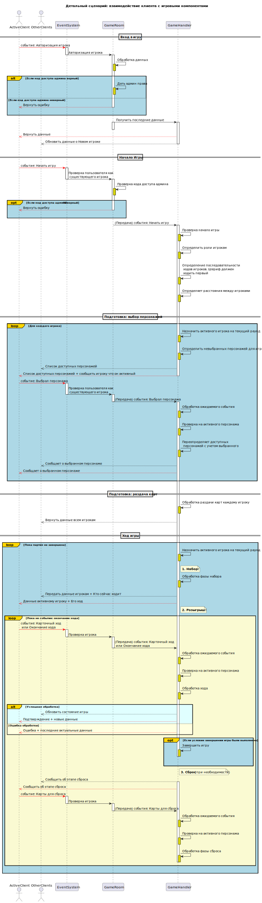

# Игра Bang

## Оглавление

1. [Обзор](#обзор)  
2. [Диаграммы](#диаграммы)  
   2.1. [Общая диаграмма архитектуры](#1-общая-диаграмма-архитектуры)  
   2.2. [Диаграмма последовательности: Взаимодействие клиента с игровыми компонентами](#2-диаграмма-последовательности-взаимодействие-клиента-с-игровыми-компонентами)  
   2.3. [Диаграмма компонентов бизнес-логики](#3-диаграмма-компонентов-бизнес-логики)  
   2.4. [Диаграмма взаимодействия клиента с основными компонентами бизнес-логики и серверными компонентами](#4-диаграмма-взаимодействия-клиента-с-основными-компонентами-бизнес-логики-и-серверными-компонентами)  
   2.5. [Диаграмма активности "Процесс авторизации игрока в системе"](#5-диаграмма-активности-процесс-авторизации-игрока-в-системе)  
3. [Как запустить](#как-запустить)  
4. [Лицензия](#лицензия)

---

## Обзор

Основная цель движка — управление игровым процессом, валидация событий, обработка действий игроков и организация взаимодействия между клиентами и сервером. Система построена таким образом, чтобы каждый компонент отвечал за свою часть логики, а события запускали соответствующие процессы.

Вся игровая логика построена вокруг событий, таких как "карточный ход", "окончание хода" и другие, которые обрабатываются через систему событий и передаются между различными компонентами.

## Диаграммы

### 1. Общая диаграмма архитектуры

Эта диаграмма дает общий обзор архитектуры игры, включая основные компоненты, их взаимодействия и связи. Мы видим компоненты, управляющие сессиями игры, состоянием игроков и картами, а также систему событий, которая координирует действия.

### 2. Диаграмма последовательности: Взаимодействие клиента с игровыми компонентами

Диаграмма показывает процесс взаимодействия клиента с сервером.

### 3. Диаграмма компонентов бизнес-логики

Здесь показана структура компонентов бизнес-логики, которые обрабатывают игровые события и управляют состоянием игры, состоянием игроков, а также взаимодействуют через систему событий.

### 4. Диаграмма взаимодействия клиента с основными компонентами бизнес-логики и серверными компонентами

Эта диаграмма иллюстрирует, как клиент взаимодействует с сервером и основными компонентами игры. Включает обработку игровых событий и обмен данными между клиентами и сервером.

### 5. Диаграмма активности "Процесс авторизации игрока в системе"

Диаграмма отражает процесс авторизации игрока в системе. Сначала `AuthSystem` получает и разбирает событие авторизации, проверяет его корректность, а затем выполняет авторизацию с использованием данных из `GameRoom` и `ConnectedUsers`.

Если передан идентификатор сессии, выполняется попытка найти игрока по нему. При успешном нахождении и отсутствии актуальной сессии, она устанавливается, и авторизация завершается. Если идентификатор не передан или игрок не найден, происходит проверка имени. По имени также осуществляется поиск игрока и проверка сессии. В случае отсутствия игрока и при наличии свободных мест создаётся новый подключённый пользователь и добавляется в список. Далее устанавливается актуальная сессия, и авторизация подтверждается.

**Возможные ошибки в процессе авторизации:**

- Событие авторизации не зарегистрировано в системе  
- Отсутствуют данные для входа по идентификатору сессии  
- Некорректное или отсутствующее имя  
- Игрок с таким именем уже существует  
- Нет свободного места для подключения  
- Не удалось создать нового игрока  
- Не удалось добавить игрока в список  

## Как запустить

Для запуска и тестирования проекта следуйте инструкциям по установке зависимостей и настройке серверного окружения. Подробнее можно узнать в файле INSTALL.md.

## Лицензия

Этот проект распространяется под лицензией MIT. См. файл LICENSE для подробностей.
